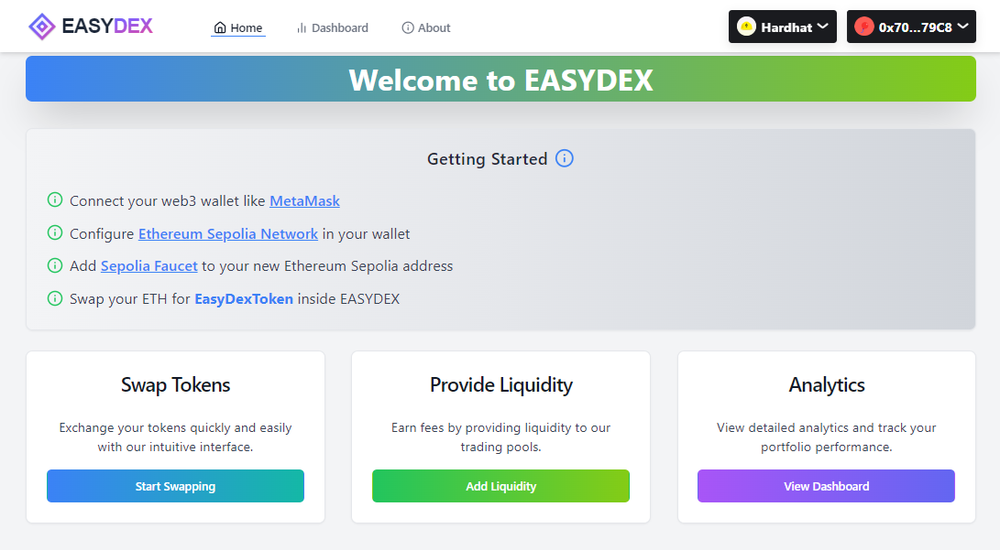
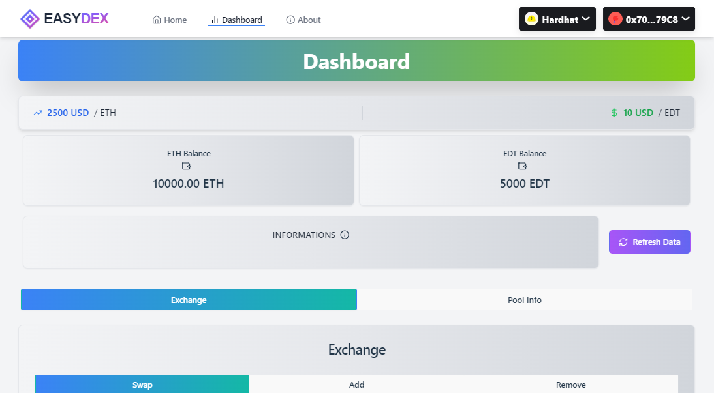
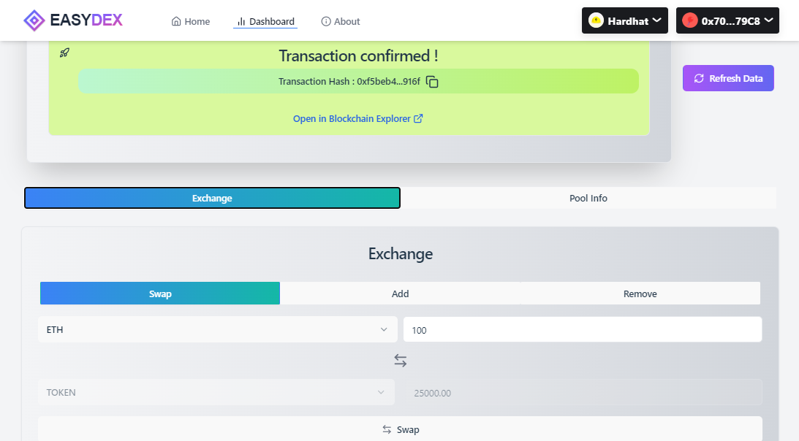
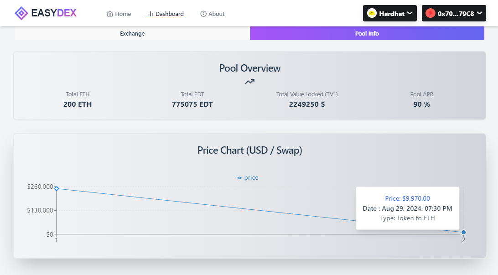
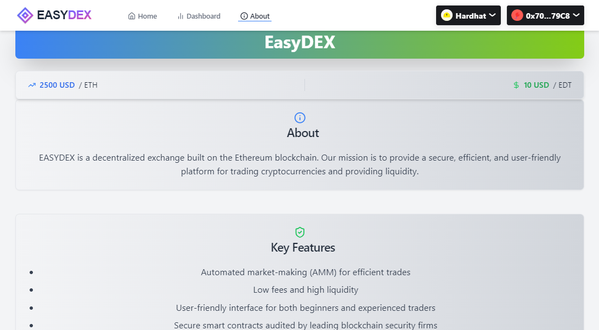

<div align="center">
  

# EasyDEX - Simplified Decentralized Exchange

[](https://docs.soliditylang.org/en/v0.8.24/)
[](https://hardhat.org/)
[](https://vitejs.dev/)
[](https://reactjs.org/)
[](https://tailwindcss.com/)
[](https://wagmi.sh/)
[](https://opensource.org/licenses/MIT)

A simplified decentralized exchange (DEX) built on the blockchain, enabling users to swap tokens, manage liquidity, and track swap history in real-time with interactive charts.Empower your swaping experience with transparency and security.

<div align="center">
  
</div>

[Explore Demo](https://easydex.vercel.app/) • [Report Bug](https://github.com/adelamare-blockchain/dApp_EASYDEX_DeFi-platform/issues) • [Request Feature](https://github.com/adelamare-blockchain/dApp_EASYDEX_DeFi-platform/issues)

</div>

## 📑 Table of Contents

- 🌟 [Features](#-features)
- 🛠️ [Tech Stack](#️-tech-stack)
- 🏗️ [Architecture](#️-architecture)
- 🚀 [Quick Start](#-quick-start)
- 📘 [Smart Contract](#-smart-contract)
- 💻 [Frontend](#-frontend)
- 📊 [Real-time Swap Tracking](#-real-time-swap-tracking)
- 🧪 [Testing](#-testing)
- 🌐 [Deployment](#-deployment)
- 📸 [Screenshots](#-screenshots)
- 🛣️ [Roadmap](#️-roadmap)
- 🤝 [Contributing](#-contributing)
- 📄 [License](#-license)
- 🙏 [Acknowledgments](#-acknowledgments)

## 🌟 Features

- 💱 Swap tokens with ease
- 💧Add and remove liquidity
- 📊 Real-time price oracle integration
- 📈 Interactive swap history chart
- 🔒 Secure and transparent transactions
- 🌐 Cross-platform compatibility (Desktop & Mobile)
- 💾 Local storage for persisting user swap history

## 🛠️ Tech Stack

### Backend

- Solidity ^0.8.24
- Hardhat 2.22.5
- OpenZeppelin Contracts 5.0.2
- Chainlink Contracts
- Ethers.js 6.4.0

### Frontend

- React 18.3.1
- Vite 5.3.4
- TailwindCSS 3.4.6
- RainbowKit 2.1.3
- wagmi 2.12.2
- Recharts 2.12.7

### Testing & Quality Assurance

- Chai
- Mocha
- Hardhat Network Helpers
- Solidity Coverage

## 🏗️ Architecture

```sh
easydex/
├── backend/
│   ├── contracts/
│   │   ├── DEX.sol
│   │   ├── Token.sol
│   │   └── Oracle.sol
│   ├── test/
│   │   └── DEX.test.js
│   ├── scripts/
│   │   └── deploy.js
│   ├── hardhat.config.js
│   └── package.json
├── frontend/
│   ├── src/
│   │   ├── components/
│   │   ├── pages/
│   │   └── main.jsx
│   ├── public/
│   └── package.json
└── README.md
```

## 📜 Smart Contract

Our DEX is powered by three main smart contracts:

1. `DEX.sol`: The core exchange functionality
2. `Token.sol`: ERC20 token implementation
3. `Oracle.sol`: Price feed integration with Chainlink

### Key Functions in `DEX.sol`

```solidity
function swap(uint256 _ethAmountIn, uint256 _tokenAmountIn) external payable;
function addLiquidity(uint256 ethAmount, uint256 tokenAmount) external payable;
function removeLiquidity(uint256 ethAmount, uint256 tokenAmount) external payable;
```

## 🚀 Deployed on SEPOLIA testnet

🔍 [**View full contract on Etherscan**](https://sepolia.etherscan.io/address/0x26e5bdb49c99497beb37d11b7ab76a5bd10486d6#code)

## 🖥️ Frontend

Our frontend provides an intuitive interface for seamless interaction with the DEX:

- 🌈 Connect wallet using RainbowKit
- 💱 Swap tokens with real-time price updates
- 💧 Manage liquidity pools
- 📊 View exchange rates and pool statistics
- 📈 Interactive swap history chart with Recharts
- 📱 Responsive design for optimal mobile and desktop experience

## 📊 Real-time Swap Tracking

EasyDEX features a powerful real-time swap tracking system:

- 📈 Interactive line chart displaying swap history
- 💾 Persistent storage using localStorage for each user
- 🔄 Automatic updates after each swap transaction
- 🔍 Detailed tooltips showing swap information
- 📊 Y-axis displays price in USD, X-axis shows swap count

### Chart Features

- Responsive design that adapts to different screen sizes
- Custom styling with gradients and hover effects
- Tooltips with formatted currency display
- Legend for easy data interpretation

This feature provides users with valuable insights into their trading activity and market trends directly within the DApp interface.

## 🚀 Getting Started

1. Clone the repository

```sh
git clone https://github.com/adelamare-blockchain/dApp_EASYDEX_DeFi-platform.git
```

2. Install dependencies

```sh
cd backend && yarn
cd ../frontend && yarn
```

3. Set up environment variables (refer to `.env.example` in both directories)

4. Run the development server

```sh
# Terminal 1: Backend
cd backend
yarn hardhat node

# Terminal 2: Backend
cd backend
yarn hardhat run scripts/deployTest.js --network localhost

# Terminal 3: Frontend
cd frontend
yarn dev
```

5. Open `http://localhost:5173` in your browser

## 🧪 Testing

We've rigorously tested all functionalities using Hardhat. Run the test suite:

```sh
cd backend
yarn hardhat test
```

<details>
<summary>View Test Results</summary>

```sh
DEX.sol
Deployment
✔ Should set the right token address and oracle
✔ Should set the right owner for Oracle, Token and DEX contracts
✔ Should have initial liquidity set to 0
Liquidity Management
✔ Should add ETH liquidity
✔ Should add token liquidity
✔ Should remove ETH liquidity
✔ Should remove token liquidity
✔ Should revert if tokenAmount or ethAmount is zero or if both tokenAmount and ethAmount
✔ Should revert if insufficient liquidity in the pool
✔ Should allow addr1 to withdraw his removed ETH liquidity
Swapping
✔ Should add sufficient token liquidity before swap
Exchange rate : 250 UTT/ETH
TOKEN amount out :
997.0 UTT | 9970 $USD
FEE : 3.0 UTT | 30 $USD
Eth LIQUIDITY :
14.0 ETH
Token LIQUIDITY :
1503.0 UTT | 15030 $USD
✔ Should swap ETH for tokens and update liquidity
ETH amount out : 3.988 ETH | 9970 $USD
FEE : 0.012 ETH | 30 $USD
Eth LIQUIDITY : 6.012 ETH
Token LIQUIDITY : 3500.0 UTT | 35000 $USD
✔ Should swap tokens for ETH and update liquidity
✔ Should revert for a swap ETH for tokens with tokenAmount or ethAmount at zero
✔ Should revert for a swap Tokens for ETH with both tokenAmount and ethAmount values
✔ Should revert if both ETH and tokens are provided
✔ Should revert if swap delay is superior to 1 minute
✔ Should revert if swap amount is superior to the dex limit
Fees Management
✔ Should allow owner to update the trading fee
✔ Should fail to set fee above maximum
✔ Should collect token fees on swaps
✔ Should collect eth fees on swaps

Oracle.sol
Deployment
✔ Should set the right owner
Get Price
✔ Should return the latest price from Chainlink

Token.sol
Deployment
✔ Should set the right owner
✔ Should assign the total supply of tokens to the owner
✔ Should set the max supply correctly
Minting
✔ Should allow owner to mint tokens
✔ Should not allow minting more than max supply
✔ Should revert if non-owner tries to mint tokens
Burning
✔ Should allow the owner to burn tokens
✔ Should not allow burning more tokens than the owner's balance

·--------------------------------|---------------------------|-------------|-----------------------------·
| Solc version: 0.8.24 · Optimizer enabled: true · Runs: 200 · Block limit: 30000000 gas │
·································|···························|·············|······························
| Methods
 │
·············|···················|·············|·············|·············|···············|··············
| Contract · Method · Min · Max · Avg · # calls · eur (avg) │
·············|···················|·············|·············|·············|···············|··············
| DEX · addLiquidity · 55473 · 108733 · 70133 · 10 · - │
·············|···················|·············|·············|·············|···············|··············
| DEX · removeLiquidity · 49877 · 56033 · 53981 · 6 · - │
·············|···················|·············|·············|·············|···············|··············
| DEX · setFee · - · - · 29750 · 2 · - │
·············|···················|·············|·············|·············|···············|··············
| DEX · swap · 77242 · 111442 · 107929 · 10 · - │
·············|···················|·············|·············|·············|···············|··············
| DEX · withdrawEth · - · - · 30981 · 1 · - │
·············|···················|·············|·············|·············|···············|··············
| DEX · withdrawFees · 33020 · 41944 · 37482 · 2 · - │
·············|···················|·············|·············|·············|···············|··············
| Token · approve · - · - · 46406 · 8 · - │
·············|···················|·············|·············|·············|···············|··············
| Token · burn · - · - · 36219 · 1 · - │
·············|···················|·············|·············|·············|···············|··············
| Token · transfer · 51610 · 51622 · 51616 · 2 · - │
·············|···················|·············|·············|·············|···············|··············
| Deployments · · % of limit · │
·································|·············|·············|·············|···············|··············
| DEX · - · - · 1788584 · 6 % · - │
·································|·············|·············|·············|···············|··············
| MockAggregatorV3 · - · - · 131616 · 0.4 % · - │
·································|·············|·············|·············|···············|··············
| Token · - · - · 830533 · 2.8 % · - │
·--------------------------------|-------------|-------------|-------------|---------------|-------------·

32 passing (2s)

Done in 5.69s.
```

</details>

## 🌐 Deployment

1. Deploy the smart contract

```sh
cd backend
yarn hardhat run scripts/deploy.js --network sepolia
```

2. Get automatically the contract addresses & ABIs in `frontend/src/constants/contractInfo.jsx`

3. Build and deploy the frontend

```sh
cd frontend
yarn build
# Deploy the 'dist' directory to your preferred hosting service
```

## 📸 Screenshots

<div align="center">
  
  
  
   
</div>

## 🛣️ Roadmap

- Implement multi-token support
- Add yield farming capabilities
- Integrate with additional oracle providers
- Implement governance features
- Enhance swap history analytics with more metrics and visualizations
- Add export functionality for swap history data

## 🤝 Contributing

Contributions are welcome! Please check out our Contribution Guidelines for details on our code of conduct and the process for submitting pull requests.

## 📄 License

This project is licensed under the MIT License. See the LICENSE file for details.

## 🙏 Acknowledgments

- OpenZeppelin for secure smart contract libraries
- Hardhat for Ethereum development environment
- Chainlink for reliable oracle data
- RainbowKit for wallet connection UI
- TailwindCSS for utility-first CSS framework

<div align="center">
  Made with ❤️ by Blockchain & Cie (https://www.linkedin.com/company/blockchain-cie)
</div>
